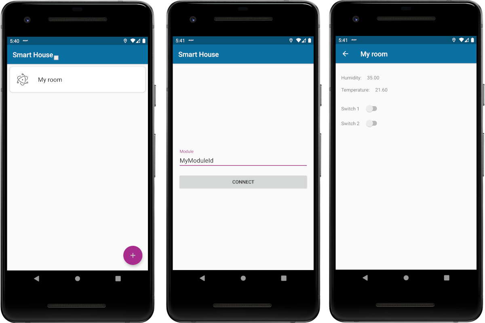

# Smart House
Smart House is a project which demonstrates IoT using Android, Firebase and Arduino.

### Main idea
We are living in a century of advanced computing technologies. Almost all of the work is done 
by the help of automation systems or computer controlled. As technology is upgrading day by day, 
people want more security and comfort in their daily life. Such kind of things like _Smart home technologies_, 
also often referred to as _home automation_ or _domotics_ (from the Latin _"domus"_ meaning home), 
provides homeowners with security, comfort, convenience and energy efficiency by allowing them to control smart devices, 
often by an applications on their smartphones or other networking devices.
The **“Smart House”** enhanced the better living for mankind.

### Goal of the project
In the project, we provide features like a light control system and indoor humidity and temperature measurement. 
Important thing is that all these operations can be done through a mobile device by using an android application. 
So, being far from home, users are still able to turn on or turn off lights or know the level of humidity and 
temperature inside their rooms. Basically, our goal is to make life more adaptable and modern, to provide users 
with the comforts that computer technologies give us.

### Basic concepts
This project was created applying knowledge of hardware(using _ESP-8266 NodeMCU V3_, _RELAY_ and _DHT11_ components) and 
software (_Arduino_, _Android Studio_, _Firebase Authentication_, _Firebase Realtime Database_) parts. 
Below we present step by step instructions(tutorial) to complete this project.

### How does it work?
Simply our module will have two modes. They are **“configuration”** mode and **“default”** modes. When the module is 
in configuration mode it will act as _a wifi router (Access Point mode)_. In this state our mobile phone connects to it 
as _a wifi client_ to send the name (SSID) and the password of a WiFi to which will be connected our **module** 
when it goes to default mode to have access to the Internet. In default mode it connects the WiFi and starts to 
send humidity and temperature and listens for light turning on or off commands. To toggle between _“default”_ and 
_“configuration”_ modes the module will have a **button** and **LED** will tell in which mode the module is in. 
The LED is turned on when it is in configuration mode.

## Getting Started
These instructions will get you a copy of the project up, a running android application on your android phone and 
ready to use **Smart Home** module.

### What do we need?
1. **ESP-8266 NodeMCU V3** - a low-cost Wi-Fi microchip with full TCP/IP stack and microcontroller capability produced 
by manufacturer Espressif Systems in Shanghai.
2. **DHT11** - basic, ultra low-cost digital temperature and humidity sensor.
3. **Reley** - electromagnetically operated electrical switch - an electromechanical switch.
4. **Power MB V2** - The MB102 is a breadboard power supply module manufactured by the _YwRobot Corporation_ in China.
5. **LED 3.3, V Button (any), Bread Board, connectors**.
6. **Arduino IDE** - The open-source Arduino Software (IDE) makes it easy to write code and upload it to the board. 
It runs on Windows, Mac OS X, and Linux.
7. **Android Studio** - Android Studio is the official integrated development environment for Google's Android 
operating system.
8. **Google account**

### Server side
1. Create firebase project
   Go to https://console.firebase.google.com and sign in with your google account. Create a new project there. 
   You can follow this https://www.youtube.com/watch?v=6juww5Lmvgo official guide while creating a project.
2. Create database

    
   
   Click the `“Database”` button from the menu, then “Create database” from the opened page. 
   
    
   
   Your database is ready to use.  
3. Setup Firebase Authentication

    
   
   Click `“Authentication”` from the menu, then from the `“Sign-in method”` tab enable `“Email/Password”` method 
   from the dialog that appears when you click it.

### Hardware part
1. Dealing with ESP-8266 NodeMCU V3
This tutorial supposes that Arduino IDE is ready to use on your computer. Our first step is to make  ESP8266 be able to 
operate in two different modes: Wi-Fi station, Wi-Fi access point.
In  `Tools > Board`, make sure that the needed module was chosen. We need a Node MCU 1.0 (ESP-12E module). 
After a successful connection to ESP-8266 from Arduino IDE clone 
the repository from the link https://github.com/chorobaev/smart-house-esp8266-arduino. 
When you open the smart_house.ino file via Arduino IDE you see something like below at the beginning of the file.
    ```
    #define FIREBASE_HOST "FIREBASE-HOST-URL"
    #define FIREBASE_AUTH "FIREBASE-AUTH-TOKEN"
    ```
   Here you should replace `“FIREBASE-HOST-URL”` with your firebase project’s URL and `“FIREBASE-AUTH-TOKEN”` with 
   your firebase projects’s auth token. They can be found on your projects setting page as below.
   
   
   
   
   
   On the red line you will find your `“FIREBASE-AUTH-TOKEN”.`
   
   Then go to the database section that you created earlier, and copy your `“FIREBASE-HOST-URL”` from there. 
   Below it is underlined.
   
   
   
   After that the Arduino code is ready to upload onto the ESP module. Upload it to the module.
   
2. Combining hardware parts
   In order to connect all hardware elements, we need to use a breadboard and be aware with it’s connection 
   diagram (the image below).
   
   
   
   Make sure that power MP V2 is supplying 5V. The module is ready to turn on.
   
   More detailed information about breadboard connection: 
   https://www.sciencebuddies.org/science-fair-projects/references/how-to-use-a-breadboard 
   https://electronicsclub.info/breadboard.html
   
   
   
   
   
### Software part
As it was mentioned before, one of the project’s goals is to let users to control the electricity of a home anywhere 
via Internet. This is done by using an android application which can be installed to each android smartphone, 
and applying _“Firebase Realtime Database”_ which provides the connection between ESP-8266 NodeMCU V3 and a mobile phone.

1. Requirements
   We suppose that you have installed Android Studio. It is installation is out of our tutorial. If you have 
   not installed it yet checkout this page https://developer.android.com/studio/install.
2. Cloning github repository
   Clone [this](https://github.com/chorobaev/smart-house-android) repository. After that open it via Android Studio.
3. Setting Firebase up
   Go to https://console.firebase.google.com and open the project that we created earlier. Go to project settings and 
   click the button as in picture bellow to add android app.
   
   
   
   From the appeared window fill fields as following, and press “Register app” button.
   
   
   
   Then press _“Download google-services.json”_. After that you can leave the dialog page or click 
   `“Next” > “Next” > “Skip this step”` options.
   
   
   
4. Run android project

   
   Copy just downloaded `“google-services.json”` file into your “app” directory of the android project. Then run 
   the app on your physical android device (emulator does not work as it cannot connect to WiFi access point). All done.
   
   Here is how it looks! Press the `“+”` button to mount a module. In the appeared screen enter the name of the module 
   in our case it is
   
   
   
## Conclusion
This project has some limitations as it is a demo project. Hope it could demonstrate power of IoT and give some
idea what kind of great things can be made.

Copyright (c) 2020 Nurbol Chorobaev 